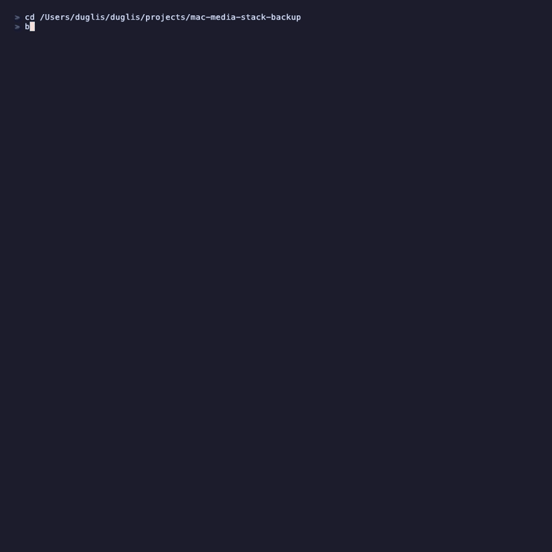
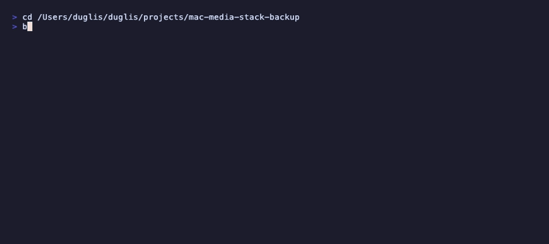

<div align="center">
  <br>
  <a href="#quick-start">
    
  </a>
  <br><br>
  <strong>Automated backup and restore for your *arr Docker stack on macOS</strong>
  <br>
  <sub>Your Sonarr database will corrupt eventually. Your config will vanish after a bad update.<br>This runs nightly so you never lose more than a day.</sub>
  <br><br>
  
  
  
  
  <br><br>
  
  
  <br><br>
</div>

## Why Backup?

You will lose your Sonarr database at some point. A failed Docker update, a corrupt SQLite file, an accidental `docker compose down -v`. When it happens, you lose all your series, quality profiles, custom formats, indexer configs, and download history. Rebuilding takes hours.

This tool backs up configs, databases, and compose files every night. When something breaks, you restore in one command and you're back to where you were yesterday.

## What It Backs Up

| Item | Details |
|------|---------|
| **Config files** | config.xml, config.yml, settings.json, *.conf from each service |
| **Databases** | All *.db files (Sonarr, Radarr, Prowlarr, Lidarr, Bazarr, etc.), snapshot-backed with sqlite3 when available |
| **Compose file** | docker-compose.yml |
| **Environment** | .env (sensitive values redacted) |
| **Container state** | Snapshot of running containers at backup time |

Backups are compressed tarballs stored in `~/Media/backups/` (or your custom `--path`). Old backups are pruned automatically (default: keep 14 days).

## See It In Action

<details>
<summary>Backup demo</summary>
<br>

</details>

<details>
<summary>Restore --list</summary>
<br>

</details>

## Quick Start

```bash
git clone https://github.com/liamvibecodes/mac-media-stack-backup.git
cd mac-media-stack-backup
bash backup.sh
```

## Scheduled Backups

Install a nightly backup at 2am:

```bash
bash install.sh
```

Customize the schedule:

```bash
bash install.sh --hour 3    # run at 3am instead
bash install.sh --path /Volumes/External/Media --keep 30
```

Remove the scheduled backup:

```bash
bash install.sh --uninstall
```

## Restore

List available backups:

```bash
bash restore.sh --list
```

Restore the most recent backup:

```bash
bash restore.sh --latest
```

Restore a specific backup:

```bash
bash restore.sh 20260222-020000
```

The restore process stops your containers, copies configs and databases back, restarts everything, and runs a health check.
If container restart fails, the script exits non-zero and prints clear remediation steps instead of claiming success.

**Note:** .env values are redacted in backups for security. After restoring, check your .env file and re-add any secrets if needed.

## Custom Media Path

All scripts default to `~/Media`. Use `--path` for a different location:

```bash
bash backup.sh --path /Volumes/External/Media
bash restore.sh --latest --path /Volumes/External/Media
bash install.sh --path /Volumes/External/Media --keep 30
```

If your stack repo is not in the same directory as your media library, also set `--stack-dir`:

```bash
bash backup.sh --path /Volumes/External/Media --stack-dir ~/mac-media-stack
bash restore.sh --latest --path /Volumes/External/Media --stack-dir ~/mac-media-stack
bash install.sh --path /Volumes/External/Media --stack-dir ~/mac-media-stack
```

## Works With

- [mac-media-stack](https://github.com/liamvibecodes/mac-media-stack) — One-command Plex + Sonarr + Radarr setup
- [mac-media-stack-advanced](https://github.com/liamvibecodes/mac-media-stack-advanced) — Power-user setup with transcoding, quality profiles, and automation

## Author

Built by [@liamvibecodes](https://github.com/liamvibecodes)

## License

[MIT](LICENSE)
